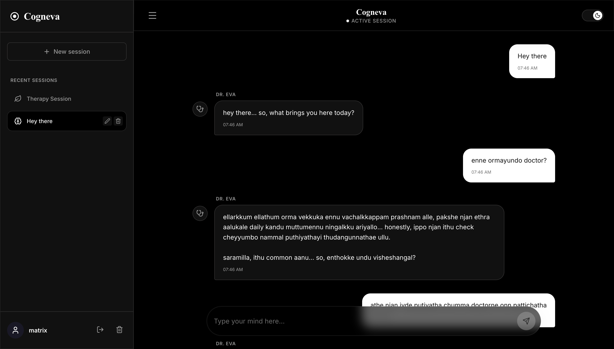

# 🧠 Cogneva

> An AI Therapist platform that combines Retrieval-Augmented Generation (RAG), semantic long-term memory, and clinical knowledge retrieval to deliver context-aware mental wellness conversations.


---

## Application Preview



---

# About

Cogneva is an AI Therapist platform designed to simulate thoughtful, context-aware psychological conversations through modern AI engineering techniques.

Unlike traditional AI chatbots that depend only on the current conversation, Cogneva combines long-term semantic memory, Retrieval-Augmented Generation (RAG), and a curated psychology knowledge base to maintain continuity across conversations while grounding responses in relevant therapeutic concepts.

The platform follows a fully decoupled architecture consisting of a SvelteKit frontend, a FastAPI backend, PostgreSQL with pgvector for semantic retrieval, and Google Gemini orchestrated through Agno.

---

# Core Capabilities

### 🧠 AI Therapist

* Context-aware therapeutic conversations
* Persona-driven psychologist agent
* Long-term conversational memory
* Psychological knowledge retrieval
* Semantic reasoning across previous sessions

### 📚 Clinical Knowledge Engine

Cogneva maintains a curated library of psychology resources that are indexed using vector embeddings.

When a conversation requires evidence-based techniques, relevant psychological concepts are retrieved through semantic similarity search and injected into the model's reasoning process using Retrieval-Augmented Generation (RAG).

### 🧩 Memory System

Rather than storing only chat history, Cogneva maintains semantic memories across multiple conversations.

Relevant memories are dynamically retrieved whenever they improve the quality or continuity of future responses.

### 🔐 Secure User Experience

* Secure authentication
* Multiple therapy sessions
* Rename and organize sessions
* Delete sessions
* Light & Dark mode
* Privacy-first account deletion

---

# Architecture

```
User
   │
   ▼
SvelteKit Frontend
   │
Authentication
   │
   ▼
FastAPI Backend
   │
───────────────
│             │
▼             ▼
Long-term    Clinical
Memory       Knowledge Base
(PostgreSQL) (pgvector)
│             │
└──────┬──────┘
       ▼
    Agno Agent
       │
 Google Gemini
       │
       ▼
Therapeutic Response
```

---

# Technology Stack

| Layer            | Technology      |
| ---------------- | --------------- |
| Frontend         | SvelteKit       |
| Backend          | FastAPI         |
| AI Agent         | Agno            |
| LLM              | Google Gemini   |
| Database         | PostgreSQL      |
| Vector Database  | pgvector        |
| ORM              | SQLModel        |
| Authentication   | SQLite + bcrypt |
| Containerization | Docker          |

---

# Key Features

* AI Therapist interface
* Retrieval-Augmented Generation (RAG)
* Cross-session semantic memory
* Clinical knowledge retrieval
* Secure authentication
* Dockerized deployment
* Responsive interface
* Light & Dark mode
* Multiple therapy sessions
* Session management
* Privacy-focused architecture

---

# Disclaimer

Cogneva is an AI-powered conversational application created for educational and research purposes.

It is intended to explore modern conversational AI techniques such as Retrieval-Augmented Generation, semantic memory, and long-term context management. It is not a substitute for licensed mental health professionals, clinical diagnosis, or emergency services.

---

# License

MIT License
