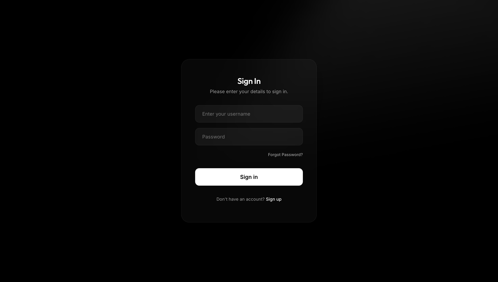
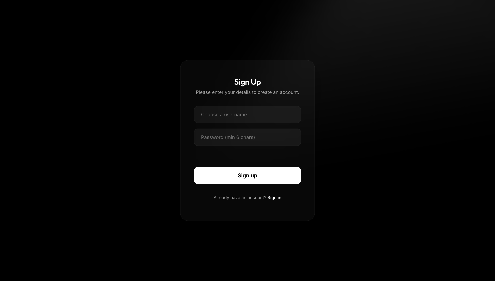
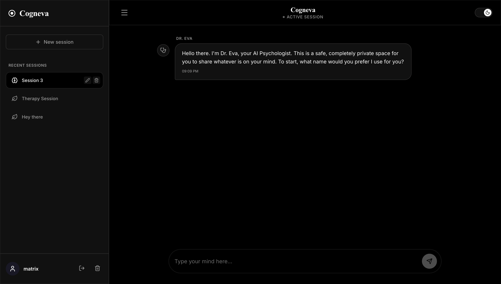

# 🧠 Cogneva

> **An AI Therapist powered by Retrieval-Augmented Generation (RAG), semantic long-term memory, and evidence-informed psychological knowledge to deliver personalized mental wellness conversations in English and natural Manglish.**


---

# Application Preview

## Login



---

## Signup



---

## Dashboard



---

## Therapy Session


---

# 📖 Overview

Cogneva is an AI Therapist platform designed to provide thoughtful, empathetic, and context-aware mental wellness conversations through modern AI engineering.

Unlike conventional AI chatbots that rely only on the active conversation, Cogneva combines semantic long-term memory, Retrieval-Augmented Generation (RAG), and a curated psychological knowledge base to maintain conversational continuity while grounding responses in relevant therapeutic concepts.

The system is capable of conversing naturally in **English** as well as **Manglish (Malayalam-English)**, enabling a more familiar and comfortable experience for bilingual users.

Built with a fully decoupled architecture, Cogneva separates the frontend, backend, authentication, and clinical memory into independent components, making the platform scalable, modular, and easier to maintain.

---

# ✨ Highlights

### 🧠 AI Therapist

* Empathetic psychologist persona
* Natural conversations in English & Manglish
* Context-aware therapeutic responses
* Long-term semantic memory
* Evidence-informed psychological guidance

### 📚 Retrieval-Augmented Generation (RAG)

Rather than relying solely on the language model, Cogneva maintains a curated psychology library indexed using vector embeddings.

Whenever a conversation requires therapeutic techniques, CBT principles, or psychological concepts, the system retrieves the most relevant knowledge using semantic similarity search and injects it into the model before generating a response.

This helps produce responses that remain grounded in relevant psychological knowledge instead of relying only on the LLM's internal knowledge.

### 🧩 Semantic Memory

Cogneva does more than remember chat history.

The application stores meaningful semantic memories from previous conversations and retrieves only the memories that are relevant to the user's current situation.

This allows conversations to remain coherent across multiple sessions without overwhelming the model with unnecessary context.

### 🔐 Privacy First

* Secure authentication
* Password hashing using bcrypt
* Multiple therapy sessions
* Rename or delete sessions
* Permanent account deletion
* Cascading removal of associated conversations and memories

---

# 🏗️ Architecture

```text
                    User
                      │
                      ▼
             SvelteKit Frontend
                      │
          Authentication & Sessions
                      │
                      ▼
               FastAPI Backend
                      │
        ┌─────────────┴─────────────┐
        ▼                           ▼
 Semantic Memory             Clinical Knowledge
  (PostgreSQL)                  (pgvector)
        │                           │
        └─────────────┬─────────────┘
                      ▼
                 Agno Agent
                      │
               Google Gemini
                      │
                      ▼
            Therapeutic Response
```

---

# ⚙️ Technology Stack

| Layer                | Technology      |
| -------------------- | --------------- |
| Frontend             | SvelteKit       |
| Backend              | FastAPI         |
| AI Agent Framework   | Agno            |
| Large Language Model | Google Gemini   |
| Database             | PostgreSQL      |
| Vector Database      | pgvector        |
| ORM                  | SQLModel        |
| Authentication       | SQLite + bcrypt |
| Embeddings           | Nomic Embed     |
| Containerization     | Docker          |

---

# 🚀 Key Features

* 🧠 AI Therapist with a consistent psychologist persona
* 🌐 Bilingual conversations (English & Manglish)
* 📚 Retrieval-Augmented Generation (RAG)
* 🧩 Cross-session semantic memory
* 📖 Psychology knowledge retrieval
* 🔐 Secure authentication & account management
* 💬 Multiple therapy conversations
* 📝 Rename & delete conversations
* 🌙 Light & Dark themes
* 🐳 Dockerized deployment
* 🏗️ Decoupled frontend & backend architecture

---

# 📂 Project Structure

```text
Cogneva/
│
├── books/                  # Psychology knowledge base
├── frontend/               # SvelteKit frontend
├── agent.py                # AI agent orchestration
├── database.py             # Database configuration
├── ingestion_library.py    # Clinical knowledge ingestion
├── main.py                 # FastAPI entry point
├── models.py               # SQLModel database models
├── prompts.txt             # Therapist prompt engineering
├── qa_test.py              # Backend testing
├── docker-compose.yml
├── Dockerfile
├── requirements.txt
└── README.md
```

---

# 🔒 Disclaimer

Cogneva is an educational and research project that demonstrates modern AI engineering techniques including Retrieval-Augmented Generation (RAG), semantic memory, prompt engineering, and conversational AI.

It is **not** a replacement for licensed psychologists, psychiatrists, crisis intervention services, or professional medical advice. Users experiencing a mental health emergency should seek immediate assistance from qualified professionals or local emergency services.

---

# 📄 License

This project is licensed under the MIT License.

---

# 👨‍💻 Author

**Anhar Eswaramangalam**

AI & Machine Learning Engineer

GitHub: https://github.com/AnharEM

LinkedIn: https://linkedin.com/in/anhareswaramangalam
